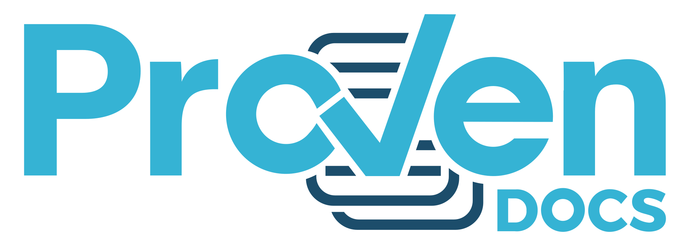

# **ProvenDocs** - Create it, Own it, Prove it.
[![Powered by ProvenDB](https://img.shields.io/static/v1.svg?label=Powered%20By&message=ProvenDB&color=35b3d4&labelColor=1c4d6b&link=https:/provendb.com&link=https:/provendb.com&logo=data:image/png;base64,iVBORw0KGgoAAAANSUhEUgAAACoAAAA0CAYAAAD8H6qwAAAAAXNSR0IArs4c6QAABk9JREFUaAXFWV2ME1UUvne6P2xcBDQY3UQDCA9L2S5LWyEaiRgIsrbgKvKjIj9PRhLDiw88+OoDDyQY39QHwp9INLLtigYRg4IsbRfpz4KRjUgIJmAEk3W3u9uZ43dnmXZmOnPbLi29STPnnnt+vt57zz1n7nBWpxaMpp5lxM66uSfGaLxJezy5uvOWkFHcBGvO19ibJXz8aIAUcvUB+gV5GKfNMqDE+GHzeF2ALpmWXsMYn2UGYqaJ0US2lX9u5tUFqMLly84Zj2ZWeIfrCtR7OtPKGXvFDMJOE/FDdl6DmTH/m9+bZ6ijO/GPnueMFkJhPufV2ceI4gvxcMfSlmF6FT6nmf2aaSI2TG3ZXjNP0Hmg/r7MUq5mDwHk05NCoPDXq9UA4OCkLZJHO2fHEoHAhN2vDiXYl1nMNDWGDZ4HjjNuELNw264w1f6YQj28kRqbx/hNzIDH3Y6yMhb2nrKPNzAcFaSlD2P+dJBE9BtX+I5YuOOcXfh++4FoeheOJXeQRLdi4YU/OPlRgtNSWzCt7WIQM3i5MTurKxaqPkhhn2vyZYf/Q5htPAotGEluFz2FOH/bYHOF3vllw5OjRr+az2A0OY9xFpDZ1BQANbUl0VQ79vZewWrAbHYKAkt+N/6y74yga9KIbZPZxTQODYR8CbOMQrSNcz7T992lx8SB/8jkIL9uFqo2DSDSaMeK77f4xNmIvr7szWMNswuZiVPOIljFzpLeS8sQrPNkJjXFmtsDvemV0JktdEjhvABUZuU+x+DnLZkJ5Pb+RHfHkFkGyHrM/doDxfGHNXzD7NROO6VMBFGrWa5wwJu5VaQDLanVskoJUaxONNPRUi5rPqOYTWkQAeBJc4HsBrimQOec/gPFBxdFiGuzF8hugjUFOvu/4fVw7FopYSz79/TWY27gzPyaAmWlU+bX11bMzZoBudFyoAjHQCT1Pn6fuRlw44tsgrFVbuOCr5E1ZcpkXYH6Tw7NAMA+BMMe/HYEe9PvygzZxxrHlU3yco7uDGQXnbDrufUdgQYimWd4diSJPIuXMKNpHwm+0Sv1LBXtCKKjbANXS9kxxouA+iOp9zhTz8LRU4aQ/tSLXTXq/3bwCQvfoSMqJehL/xQxxVIpOZixsPJAUTR4ApHkcTD2WSp9k7jIvXw81+ePxxtN7CISWztfOhYN6gy6kQh7f3Yec+bmgQKEKFmXOYsVuJDqUv5q+qTAcaJoixO3wFMOFujyqDxQ1Cg5ldE6kdJKq/KtgUh6p5Ocvr9LVEo5Dz/gpCvjmYAyNrC28zyqwF0yBWOMk7bPMbhIk1dKxJIXu72Dhp1ynxagQike9n2Mav9ISQNOwaVXSrRRqsuLLxek8vcGi4AK/t2Glu2oEVOlDBjBJS4uhGzwocFV2OrioHdsCFjyeFTL5ZejoAPTEejV7gVjxDwhgP3XQcfCEsE1U83u15maKl12TvRTf3fnDYuBMjuOQIUujo/ruClZjwJWK2ULZ+ZGkWpxrL0mlbW9ZUplbYOuQIVcLOT7HjdPH9h0HLsAuwcDrpWSfpXIWFmVkpMDKVChEA91fIi91eekXCHvRCrku1OhTl68JFAhOdqqbALYobzWFAjucJVYiZmygIpLVSxdCMlgSrco2OfDt6e3Fl0lVh2oMJgI+64wRf7a6+YYufnLcgtkNxtlzaihjMuzrzCzImgqaprtw0FFyveEKwIqdBBcu7EFzpTtDFeJidFFp8qWdxGsGCgyjzbS5OlBmr3pYtPK5vxIJQWyVbnQm9IFROYl7z/+yGCYkapfCRbMOVCkTGYth6FKWFMCKhwkwgsH8HhB0A+i4QryXook/vCDcFi+D8rjIcrlcNHG9I+i+FwzV7x5lm+o5pJBw0PT6Kw/MaN0UWegvuSjIygs6t/wUWITqrI2gQQZ8Yq4rseMcvNm3x3oTa6rJ9RgX3I5I+1TAwNWWseHoocxlGj9IPTXW+zZcbAOqA3K3qm8MhgOKnmKz44tw+pyvFy+jo8fW4FFxwUsV4k/2pkIt43ojMUnLs9pzE0git2/+FbiuCqySBR4g38xttabEfb0A//XNe3XVM6fQ8Y5XxUn92kE+/Jcjpq6DJDCnD6jZrv+aHqFQtpmXLkswE4uGjfLVo3GRsSy3wLAq4wrx+Nh7wW77f8BOCwBY4XYwqgAAAAASUVORK5CYII=)](https://img.shields.io/static/v1.svg?label=Powered%20By&message=ProvenDB&color=35b3d4&labelColor=1c4d6b&link=https:/provendb.com&link=https:/provendb.com&logo=data:image/png;base64,iVBORw0KGgoAAAANSUhEUgAAACoAAAA0CAYAAAD8H6qwAAAAAXNSR0IArs4c6QAABk9JREFUaAXFWV2ME1UUvne6P2xcBDQY3UQDCA9L2S5LWyEaiRgIsrbgKvKjIj9PRhLDiw88+OoDDyQY39QHwp9INLLtigYRg4IsbRfpz4KRjUgIJmAEk3W3u9uZ43dnmXZmOnPbLi29STPnnnt+vt57zz1n7nBWpxaMpp5lxM66uSfGaLxJezy5uvOWkFHcBGvO19ibJXz8aIAUcvUB+gV5GKfNMqDE+GHzeF2ALpmWXsMYn2UGYqaJ0US2lX9u5tUFqMLly84Zj2ZWeIfrCtR7OtPKGXvFDMJOE/FDdl6DmTH/m9+bZ6ijO/GPnueMFkJhPufV2ceI4gvxcMfSlmF6FT6nmf2aaSI2TG3ZXjNP0Hmg/r7MUq5mDwHk05NCoPDXq9UA4OCkLZJHO2fHEoHAhN2vDiXYl1nMNDWGDZ4HjjNuELNw264w1f6YQj28kRqbx/hNzIDH3Y6yMhb2nrKPNzAcFaSlD2P+dJBE9BtX+I5YuOOcXfh++4FoeheOJXeQRLdi4YU/OPlRgtNSWzCt7WIQM3i5MTurKxaqPkhhn2vyZYf/Q5htPAotGEluFz2FOH/bYHOF3vllw5OjRr+az2A0OY9xFpDZ1BQANbUl0VQ79vZewWrAbHYKAkt+N/6y74yga9KIbZPZxTQODYR8CbOMQrSNcz7T992lx8SB/8jkIL9uFqo2DSDSaMeK77f4xNmIvr7szWMNswuZiVPOIljFzpLeS8sQrPNkJjXFmtsDvemV0JktdEjhvABUZuU+x+DnLZkJ5Pb+RHfHkFkGyHrM/doDxfGHNXzD7NROO6VMBFGrWa5wwJu5VaQDLanVskoJUaxONNPRUi5rPqOYTWkQAeBJc4HsBrimQOec/gPFBxdFiGuzF8hugjUFOvu/4fVw7FopYSz79/TWY27gzPyaAmWlU+bX11bMzZoBudFyoAjHQCT1Pn6fuRlw44tsgrFVbuOCr5E1ZcpkXYH6Tw7NAMA+BMMe/HYEe9PvygzZxxrHlU3yco7uDGQXnbDrufUdgQYimWd4diSJPIuXMKNpHwm+0Sv1LBXtCKKjbANXS9kxxouA+iOp9zhTz8LRU4aQ/tSLXTXq/3bwCQvfoSMqJehL/xQxxVIpOZixsPJAUTR4ApHkcTD2WSp9k7jIvXw81+ePxxtN7CISWztfOhYN6gy6kQh7f3Yec+bmgQKEKFmXOYsVuJDqUv5q+qTAcaJoixO3wFMOFujyqDxQ1Cg5ldE6kdJKq/KtgUh6p5Ocvr9LVEo5Dz/gpCvjmYAyNrC28zyqwF0yBWOMk7bPMbhIk1dKxJIXu72Dhp1ynxagQike9n2Mav9ISQNOwaVXSrRRqsuLLxek8vcGi4AK/t2Glu2oEVOlDBjBJS4uhGzwocFV2OrioHdsCFjyeFTL5ZejoAPTEejV7gVjxDwhgP3XQcfCEsE1U83u15maKl12TvRTf3fnDYuBMjuOQIUujo/ruClZjwJWK2ULZ+ZGkWpxrL0mlbW9ZUplbYOuQIVcLOT7HjdPH9h0HLsAuwcDrpWSfpXIWFmVkpMDKVChEA91fIi91eekXCHvRCrku1OhTl68JFAhOdqqbALYobzWFAjucJVYiZmygIpLVSxdCMlgSrco2OfDt6e3Fl0lVh2oMJgI+64wRf7a6+YYufnLcgtkNxtlzaihjMuzrzCzImgqaprtw0FFyveEKwIqdBBcu7EFzpTtDFeJidFFp8qWdxGsGCgyjzbS5OlBmr3pYtPK5vxIJQWyVbnQm9IFROYl7z/+yGCYkapfCRbMOVCkTGYth6FKWFMCKhwkwgsH8HhB0A+i4QryXook/vCDcFi+D8rjIcrlcNHG9I+i+FwzV7x5lm+o5pJBw0PT6Kw/MaN0UWegvuSjIygs6t/wUWITqrI2gQQZ8Yq4rseMcvNm3x3oTa6rJ9RgX3I5I+1TAwNWWseHoocxlGj9IPTXW+zZcbAOqA3K3qm8MhgOKnmKz44tw+pyvFy+jo8fW4FFxwUsV4k/2pkIt43ojMUnLs9pzE0git2/+FbiuCqySBR4g38xttabEfb0A//XNe3XVM6fQ8Y5XxUn92kE+/Jcjpq6DJDCnD6jZrv+aHqFQtpmXLkswE4uGjfLVo3GRsSy3wLAq4wrx+Nh7wW77f8BOCwBY4XYwqgAAAAASUVORK5CYII=)

    /SouthbankSoftware/provendocs.svg)   

**NOTE** - ProvenDocs is still very much a work in progress, please be patient with us!

*More information and detailed documentation for ProvenDocs Application can be found on the **[ProvenDB ReadMe.IO](https://provendb.readme.io/docs)***

*More information and detailed documentation for ProvenDocs Source Code can be found **[here](./src/README.md)***

---

**[ProvenDocs](https://provendocs.com/#howItWorks)** is a free to use, open source tool for putting your documents on the blockchain with ease. **ProvenDocs** also encourages having multiple versions of your documents and being able to easily explore these versions, each of which is immutably placed on the block chain.
 All of this is fully powered and supported by **[ProvenDB](https://provendb.com/#howItWorks)**. 

If you do want to assert the state of your Document at a certain point in time, **ProvenDocs** will also create easy to read, detailed specifications of how and when the Document was placed on the Blockchain.

**[ProvenDocs](https://provendocs.com)** is publicly avaliable at www.ProvenDocs.com.

This repository exists to serve as an example of the kind of application we believe can be built on top of the powerful block chain enabled database that is **[ProvenDB](https://provendb.com)**.

**Table of Contents**
- [**ProvenDocs** - Create it, Own it, Prove it.](#provendocs---create-it-own-it-prove-it)
- [**Getting Started**](#getting-started)
    - [**A Note on Running locally.**](#a-note-on-running-locally)
    - [**Dependencies**](#dependencies)
  - [**Environment Requirements**](#environment-requirements)
  - [**Local Installation**](#local-installation)
  - [**Running ProvenDocs**](#running-provendocs)
- [**Contributing**](#contributing)
- [**Feedback**](#feedback)
- [**Related Projects**](#related-projects)
- [**License**](#license)

# **Getting Started**
### **A Note on Running locally.**
Unfortunately, ProvenDocs cannot currently be run natively without modifcations. This is because to create a full, secure service it has been tighly coupled with the ProvenDocs platform. However, with some modifications (detailed below) you can run your own version of ProvenDocs.
If you wish to run or create an application on top of ProvenDB, we recommend using this repository as a starting point. We plan to create a more modular version of ProvenDocs in upcoming releases.

### **Dependencies**
The following dependencies may work at other versions, however these are the known good versions:

- **[NodeJS](https://nodejs.org/en/download/)** - (v11.10.1 or above)
- **[NPM](https://www.npmjs.com/get-npm)** (v6.8.0 or above) _or_ **[Yarn](https://yarnpkg.com/lang/en/docs/getting-started/)** (v1.13.0 or above)

## **Environment Requirements**
There are a number of environment variables required to run ProvenDocs on your local machine, these variables are details [here](./ENVIRONMENT_VARIABLES.md).

## **Local Installation**
1. Clone the repository to your local machine using:

`git clone https://github.com/southbanksoftware/provendocs.git`

2. **WARNING** - To run ProvenDocs on your local machine, you will need to replace the user authentication system in the current source code. We are working on creating a guide or modified repository to help with this.
   
3. Install required Node dependencies using:

`npm install` or `yarn install` - _Note: This will also patch the file2html library in the post install for compatability_

4. Make sure you have a **[ProvenDB](https://provendb.com)** instance running and accessible.

5. Configure the required environment variables, without these variables the application will not behave as expected. Full list of environemnt variables is avaliable [here](./ENVIRONMENT_VARIABLES.md). 

## **Running ProvenDocs**
1. In the root folder of provendocs, run `yarn dev` *(for development node)* or `yarn start`
2. Open chrome and navigate to `localhost:3000`

# **Contributing**
If you wish to contribute to **ProvenDocs**, there are issues listed on **[GitHub Issues](https://github.com/SouthbankSoftware/provendocs/issues)** that are good for beginners to contribute to. You can also contact us at **developer@provendocs.com** to ask about our contribution guidelines and strategy.

# **Feedback** 
All feedback can be given as [GitHub Issues](https://github.com/SouthbankSoftware/provendocs/issues), we currently have templates for
- **Questions** - Ask questions and get help or advice relevant to ProvenDocs.
- **Feature Requests** - Ask for new features or functionality to be added to ProvenDocs.
- **Bug Report** - If you run into a bug in the product, please let us know right away so we can fix it!

# **Related Projects**
- **[ProvenDB](https://provendb.com)**.

# **License**
Copyright (c) SouthbankSoftware. All Rights reserved.
Licensed under the [AGPL-3.0](./LICENSE) license.
